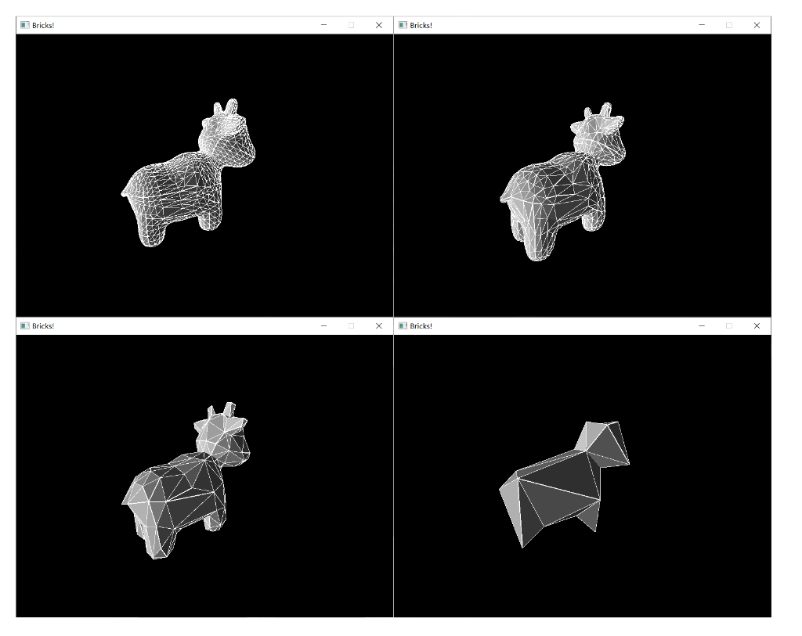
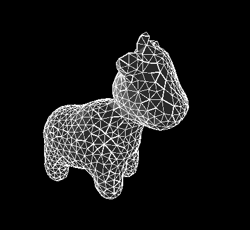

# Mesh Editor
A simple triangle mesh editor, supports upsample the mesh using Loop Subdivision, downsample the mesh using quadratic error approximation, and re-sample the mesh.

Regular triangulation

